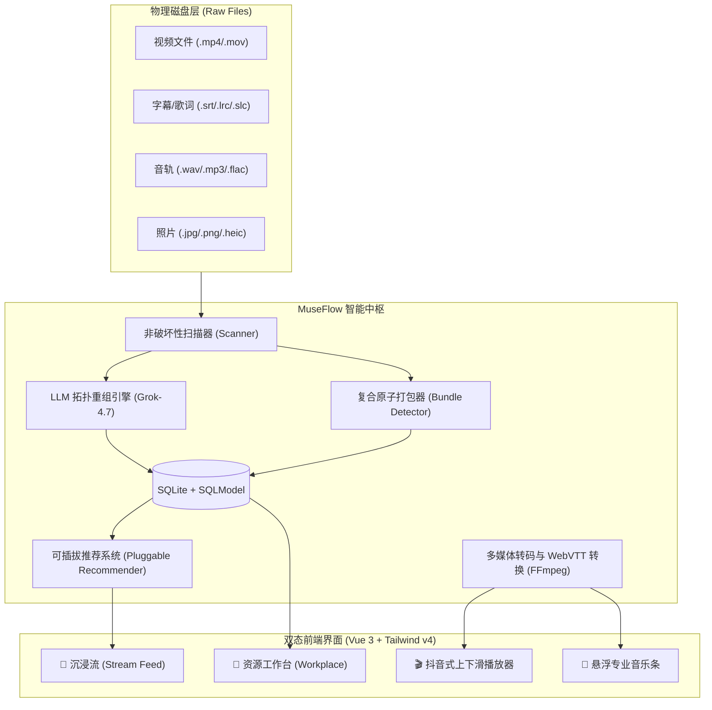

<div align="center">

# 🌊 MuseFlow (灵眸流)

### *Your Personal Algorithmic Media Stream & AI Digital Asset Hub*
**非破坏性本地媒体管理 × 算法推荐流式消费 × 大模型目录拓扑重组**

<p align="center">
  <a href="https://github.com/mcocdaa/MuseFlow/releases"></a>
  <a href="./LICENSE"></a>
  
  
  
  
</p>

<p align="center">
  <a href="#-key-features">✨ 核心特性</a> •
  <a href="#-why-museflow">💡 为什么选择 MuseFlow</a> •
  <a href="#-quick-start">🚀 极速上手</a> •
  <a href="#-architecture">🏛️ 架构设计</a> •
  <a href="#-themes">🎨 个性化主题</a> •
  <a href="#-docs--api">📖 文档与接口</a>
</p>

</div>

---

## 💡 为什么选择 MuseFlow？(Why MuseFlow?)

市面上的数字资产工具往往将**“管理 (DAM)”**与**“消费 (Streaming)”**割裂：

| 维度对比 | 传统素材管理工具 (Eagle / Billfish) | 传统家庭影院 (Jellyfin / Plex) | 传统相册系统 (Immich / PhotoPrism) | 🌊 **MuseFlow (灵眸流)** |
| :--- | :--- | :--- | :--- | :--- |
| **底层物理文件** | 强制导入专有库格式，破坏文件结构 | 物理目录映射 | 物理目录映射 | **零破坏原生索引**，随时调用外部软件 |
| **复合工程包** | 拆成孤立碎文件 | 仅识别单视频 | 无法有效处理音画字合集 | **智能识别 `mp4+srt+wav` 最小消费原子** |
| **混乱目录拓扑** | 纯人工打标签整理 | 死板扫描，不支持子系列提取 | 基于时间线强行合并 | **LLM 拓扑推断 (如 Grok-4.7) 自动剥离子系列** |
| **浏览消费手感** | 办公表格/平铺，无算法喂饭感 | 传统电影海报网格 | 传统相册时间流 | **小红书瀑布流 + 抖音上下滑视频 + 专业音乐条** |
| **跨维虚拟超集** | 仅支持单一标签 | 依赖手动建播放列表 | 仅人脸相册 | **虚拟超集 (Supersets)：跨物理目录任意组合** |
| **推荐系统** | 无推荐算法 | 仅按最新添加/继续观看 | 无 | **可插拔推荐插件 (漫游/时光回忆/智能加权)** |

---

## ✨ 核心特性 (Key Features)

### 1. 🎬 复合原子消费单元 (Smart Composite Bundling)
- 自动识别“不可再分的最小消费粒子”：
  - 一个文件夹内的 `tokyo_vlog.mp4`、`tokyo_vlog.srt` 和 `tokyo_vlog_bgm.wav` 自动捆绑为一个复合单元（`AssetUnit [bundle]`）；
  - 播放视频时，后端自动将 `.srt` / `.ass` 转换为浏览器标准的 WebVTT 格式挂载字幕；
  - 独立图片、单曲音频（附带 `.lrc` / `.slc` 歌词）、独立视频各自保持独立原子单元。

### 2. 🤖 LLM 智能目录拓扑重组 (AI Directory Topology Triage)
- **不再受制于硬编码的正则判断**：
  - 例如 `A/a1.png`, `A/a2.png`, `A/B/b1.png`，AI 自动判定子文件夹 `B` 为独立子系列并完整剥离；
  - 自动识别跨目录存放的音画字（如 `ep1.srt` 在父级，`raw/ep1.mp4` 在子级）；
  - 一键预览 AI 生成的重组提案与理由，一键确认生效，**物理磁盘文件毫发无损**。

### 3. 🌊 双态无缝切换 (Fluid Dual-Mode Experience)
- **沉浸消费流 (Stream Feed)**：
  - 瀑布流媒体卡片，带高画质智能缩略图；
  - **抖音/B 站式垂直视频播放器**：支持键盘 `↑` / `↓` 顺畅切换下一个推荐视频；
  - **沉浸相册画廊**：高帧率平滑缩放、原图查看与快速评分；
  - **专业底部音乐播放器**：专辑封面、波形滑动条、单曲循环、**睡眠定时器 (15/30/60m)**。
- **资源工作台 (Workplace)**：
  - 物理系列目录树（Collections）+ 多维虚拟超集（Supersets）；
  - 物理文件拓扑面板（清晰查看一个消费包关联的原始磁盘文件）；
  - 快捷联动：**“在系统资源管理器中定位”** 与 **“使用系统默认程序打开”**。

### 4. 🎨 7 款精选主题配色 (Personalized Themes)
内置 7 款专业调色盘，即点即生效，持久化保存：
- 🔮 **幻紫流光 (Cyber Dark)**：经典暗黑极客，霓光紫与极光靛
- 🌌 **黑曜深空 (OLED Pure Black)**：纯黑极致省电，高对比度观影神器
- 🌸 **粉黛微光 (Sakura & Bilibili)**：桃粉微光，二次元与生活记录
- ⚡ **赛博电青 (Cyberpunk Neon)**：冷调深海蓝与高饱和电光青
- 🌲 **苍翠松隐 (Forest Emerald)**：北欧静谧墨绿与薄荷青翠，适合风景旅拍
- 🌅 **落日熔金 (Sunset Amber)**：暖暮晚霞暖棕与落日熔金
- ☀️ **摄影工坊 (Studio Light)**：极简柔光素白白天模式

### 5. 🔌 可插拔推荐算法与防挂机埋点
- 自动埋点：点击率、5星即时评分、红心收藏、有效停留时长；
- **防挂机截断保护**：单次有效停留上限 180 秒，防止页面长时间后台静置导致推荐权重倾斜；
- 内置三大开箱即用算法：
  - 🎲 **探索漫游 (Discover)**：全库随机发现
  - ⏳ **时光倒流 (Flashback)**：优先推荐久未重温的尘封记忆
  - ❤️ **猜你喜欢 (Affinity)**：基于评分与偏好加权

---

## 🏛️ 系统架构 (Architecture)



---

## 🚀 极速上手 (Quick Start)

### 1. 环境准备
- **Python**: `>= 3.12`（推荐使用 [`uv`](https://github.com/astral-sh/uv)）
- **Node.js**: `>= 20`（包管理使用 `pnpm`）
- **FFmpeg**: `>= 6.0`（用于缩略图与时长提取）

### 2. 克隆与启动后端
```bash
# 克隆仓库
git clone git@github.com:mcocdaa/MuseFlow.git
cd MuseFlow/backend

# 同步依赖并启动
uv sync
uv run python run.py
# 后端服务已启动在: http://localhost:8765
```

### 3. 启动前端开发服务器 (可选，独立调试时使用)
```bash
cd ../frontend
pnpm install
pnpm dev
# 前端服务在: http://localhost:5173
```
> **提示**：MuseFlow 后端已内置静态构建托管能力。直接访问 `http://localhost:8765` 即可使用完整前后端服务！

---

## ⚙️ 环境变量与配置 (Configuration)

在 `backend/.env` 或系统环境变量中配置：

| 变量名 | 默认值 | 说明 |
| :--- | :--- | :--- |
| `MUSEFLOW_HOST` | `0.0.0.0` | 服务监听地址（支持手机/平板局域网访问） |
| `MUSEFLOW_PORT` | `8765` | 服务监听端口 |
| `LLM_BASE_URL` | `https://pool.creative-koala-llm.top/v1` | OpenAI 兼容的大模型 API 基础地址 |
| `LLM_API_KEY` | `sk-...` | 大模型 API Key |
| `LLM_MODEL` | `grok-4.7` | 用于复杂目录拓扑重组的模型（支持 Grok / Claude / GPT） |

---

## 📖 文档索引 (Documentation)

- 🏛️ [架构设计与领域实体模型](./docs/architecture.md)
- 🤖 [LLM 目录拓扑分析与重组指南](./docs/ai_triage_guide.md)
- 🔌 [可插拔推荐系统与行为埋点插件规范](./docs/recommender_plugin.md)
- 🤝 [开源贡献指南 (Contributing)](./CONTRIBUTING.md)

---

## 🗺️ 路线图 (Roadmap)

- [x] 非破坏性物理文件索引与系列树建立
- [x] 复合原子单元智能打包 (`mp4+srt+wav`, `mp3+lrc`)
- [x] 大语言模型 (Grok-4.7) 混乱目录拓扑分析与一键重组
- [x] 双态流媒体界面（小红书瀑布流 + 资源管理器工作台）
- [x] 抖音式上下滑动视频流与自适应 WebVTT 字幕挂载
- [x] 专业级悬浮音乐条与睡眠定时器
- [x] 7 款个性化沉浸主题配色与即时持久化
- [x] 跨平台原生文件管理器定位 (`explorer.exe /select`, `xdg-open`)
- [ ] 基于 OpenCV / PIL 的自适应主体构图智能裁剪
- [ ] 离线大模型 / 本地 Ollama 拓扑分析支持
- [ ] Windows 桌面端原生安装包 (`.exe` 带系统托盘)

---

## 📄 开源许可证 (License)

本项目基于 [MIT License](./LICENSE) 协议开源。欢迎自由使用、扩展与共建！
