<div align="center">

# 🌊 MuseFlow (灵眸流)

**Local-First, AI-Powered Digital Asset Hub & Algorithmic Streaming Platform**  
*Non-Destructive Local Indexing × Algorithmic Stream Consumption × LLM Directory Topology Triage*

[](https://github.com/mcocdaa)
[](https://github.com/mcocdaa/MuseFlow/actions)
[](LICENSE)
[](pyproject.toml)
[](frontend/package.json)
[](frontend/package.json)
[](CONTRIBUTING.md)

[English](README.md) | [简体中文](README_CN.md)

</div>

---

## 💡 Why MuseFlow?

Modern creators and media collectors accumulate vast amounts of fragmented media files: travel photo batches, Vlog project suites (video + external subtitles + BGM audio + cover art), lossless audio discs, and multi-tier archive folders. Traditional tools force an artificial divide between **"Digital Asset Management (DAM)"** and **"Content Consumption (Streaming)"**:

| Dimension | Traditional Asset DAMs (Eagle / Billfish) | Home Theater Servers (Jellyfin / Plex) | Cloud Photo Hubs (Immich / PhotoPrism) | 🌊 **MuseFlow (灵眸流)** |
| :--- | :--- | :--- | :--- | :--- |
| **Physical Files** | Imports to proprietary vault, destroys original folder hierarchy | Read-only physical mount | Forcefully renames or reorganizes into date-based trees | **Zero-Destruction In-Place Indexing**, physical files remain 100% untouched |
| **Composite Project Bundles** | Fragmented into loose orphan files | Treats as isolated single video | Cannot pair multitrack companion files | **Auto-detects `mp4+srt+wav` as atomic consumption particles** |
| **Chaotic Directory Topology** | Purely manual tagging | Rigid scanning, misses sub-collections | Forces chronological flattening | **LLM (Grok-4.7) Topology Triage isolates sub-series & pairs orphan files** |
| **Consumption Experience** | Spreadsheet / dense grid with no algorithmic feed | Clunky TV poster wall | Generic chronological timeline | **Xiaohongshu Waterfall + TikTok Vertical Swipe + Spotify-Grade Audio Bar** |
| **Cross-Dimension Grouping** | Single directory tag | Manual playlists | Face clusters only | **Virtual Supersets (超集) cross physical collections effortlessly** |
| **Recommender Engine** | None, manual search only | Basic "Recently Added / Continue Watching" | None | **Pluggable Recommender System (Discover / Flashback / Weighted Affinity)** |

---

## ✨ Key Features

### 1. 🎬 Smart Atom-Bundle Packaging
- **Multitrack Media United**:
  - Automatically identifies accompanying companion files. When scanning `tokyo_vlog.mp4`, `tokyo_vlog.srt`, and `tokyo_vlog_bgm.wav`, MuseFlow binds them into a single `AssetUnit [bundle]`.
  - On-the-fly subtitle transcoding: Subtitle files (`.srt`, `.ass`) are converted dynamically into browser-standard WebVTT format with automatic character encoding detection (UTF-8, GBK, GB18030).
  - Standalone pictures, lossless music tracks (with `.lrc` lyrics), and independent video files maintain particle integrity without cluttering feeds with orphan files.

### 2. 🤖 LLM Directory Topology Triage
- **Beyond Fragile Regex Rules**:
  - For messy, deeply nested folders (e.g., `A/a1.png`, `A/a2.png`, `A/B/b1.png`), MuseFlow extracts directory relative trees and metadata and prompts reasoning LLMs (Grok-4.7, Claude 3.5, GPT-4o) for semantic topology inference.
  - Automatically isolates subfolder `B` as an independent child collection.
  - Pairs cross-folder files (such as `subtitles/ep1.srt` belonging to `video/ep1.mp4`).
  - **Visual Preview & One-Click Apply**: Interactive modal shows AI reasoning and planned restructuring before executing virtual database changes—**raw disk files remain untouched**.

### 3. 🌊 Fluid Dual-Mode Experience
- **Immersive Stream Feed**:
  - Dual-column waterfall cards with high-fidelity thumbnails and duration capsules.
  - **TikTok-Style Vertical Swipe Reel**: Up/Down arrow keys smoothly cycle through recommended videos; spacebar instant pause; auto-loaded WebVTT subtitles.
  - **High-Res Lightbox Viewer**: Smooth zooming, aspect-ratio preservation, and 1~5 star rating.
  - **Floating Audio Bar**: Vinyl album spin animation, interactive scrub bar, single-loop mode, and **configurable Sleep Timer (15/30/60m)**.
- **Workplace Mode**:
  - Physical Collections Tree + Multi-dimensional Virtual Supersets.
  - File Topology Inspector: inspect exact disk locations and companion roles for any atomic bundle.
  - Native OS integration: **"Reveal in File Explorer (`explorer.exe /select`, `open -R`, `xdg-open`)"** and **"Launch in Default System App"**.

### 4. 🎨 7 Curated Design Themes
Tailored color palettes switchable instantly with persistent `localStorage` synchronization:
- 🔮 **Cyber Dark**: Neon purple and aurora indigo on deep slate
- 🌌 **OLED Pure Black**: Battery-efficient true black with hyper-contrasting media
- 🌸 **Sakura Pink**: Vibrant pink-and-white aesthetic for lifestyle logs
- ⚡ **Cyberpunk Neon**: Deep oceanic navy with electric cyan highlights
- 🌲 **Forest Emerald**: Nordic deep pine green and mint accents for landscape travel
- 🌅 **Sunset Amber**: Warm dusk brown with golden hour highlights
- ☀️ **Studio Light**: Clean, minimalist daylight studio mode

### 5. 🔌 Pluggable Recommenders with Anti-Hang Telemetry
- **Rich Behavioral Telemetry**: Click-through, 5-star ratings, favorite toggles, and dwell duration tracking.
- **Anti-Hang Protection**: Playback dwell time is strictly capped at `min(dwell, 180s)` to prevent forgotten browser tabs from distorting recommendation vectors.
- **Built-in Algorithms**:
  - 🎲 **Discover**: Library-wide exploration and serendipitous discovery
  - ⏳ **Flashback**: Prioritizes forgotten archives and rarely revisited memories
  - ❤️ **Affinity**: Personalized ranking based on user ratings and dwell times

---

## 🏛️ System Architecture

```mermaid
flowchart TD
    subgraph Storage ["1. Physical Storage Layer (Raw Files)"]
        F1["Video Files (.mp4/.mov)"]
        F2["Subtitles & Lyrics (.srt/.lrc/.slc)"]
        F3["Audio Tracks (.wav/.mp3/.flac)"]
        F4["Photos & Art (.jpg/.png/.heic)"]
    end

    subgraph CoreEngine ["2. Ingestion & Topology Triage (Muse Engine)"]
        Scanner["Local File Scanner"]
        Bundle["Atom-Bundle Detector"]
        AITriage["LLM Directory Topology Triage (Grok-4.7)"]
        Proc["FFmpeg Media Processor (Thumbnails/Duration/ID3)"]
        
        Scanner --> Bundle
        Bundle --> AITriage
        Bundle --> Proc
    end

    subgraph DataLayer ["3. Virtual Domain Model"]
        AssetUnit["AssetUnit (Atomic Unit: bundle/video/image/audio)"]
        AssetFile["AssetFile (Physical File & Companion Role)"]
        Collection["Collection (Physical Directory Hierarchy)"]
        Superset["Superset (Virtual Multi-Dimensional Groups)"]

        AssetUnit --- AssetFile
        AssetUnit --> Collection
        Superset -.-> AssetUnit
    end

    subgraph RecEngine ["4. Recommender & Telemetry Engine"]
        Telemetry["Telemetry (Click / Dwell 180s Cap / Rate / Favorite)"]
        Registry["Recommender Registry (Discover / Flashback / Affinity)"]
        
        Telemetry --> Registry
        Registry --> Feed["Dynamic Stream Feed"]
    end

    subgraph UI ["5. Client Application (Dual-Mode Vue 3 App)"]
        STREAM["Stream Feed: Waterfall / TikTok Reels / Audio Bar"]
        WORK["Workplace: Tree / Supersets / Topology / Native OS Integration"]
        THEMES["7 Curated Themes (Cyber Dark, OLED, Sakura, Neon...)"]
    end

    Storage --> Scanner
    CoreEngine --> DataLayer
    DataLayer --> RecEngine
    RecEngine --> UI
```



---

## 🚀 Quick Start

### Option A: Local Development (via `uv` & `pnpm`)

#### 1. Prerequisites
- Python: `>= 3.13` (recommended: [uv](https://github.com/astral-sh/uv))
- Node.js: `>= 20` (recommended: `pnpm`)
- FFmpeg: `>= 6.0` (for thumbnail generation and audio metadata)

#### 2. Clone & Configure
```bash
git clone git@github.com:mcocdaa/MuseFlow.git
cd MuseFlow

# Copy environment configuration
cp .env.example .env
```

#### 3. One-Command Development Server
```bash
./scripts/dev.sh
```
- Backend API: `http://localhost:8765`
- Frontend App: `http://localhost:5173`
- Interactive API Docs: `http://localhost:8765/docs`

#### 4. Generate Sample Media Library (Optional)
```bash
cd backend && uv run python generate_samples.py
```
> Synthesizes realistic travel albums, a tripartite `tokyo_vlog` bundle (`mp4+srt+wav`), and loose media files for instant demonstration.

---

### Option B: Docker Compose Deployment

Deploy with a single command:

```bash
MEDIA_PATH=/path/to/your/media docker compose up -d --build
```
- Web UI & API: `http://localhost:8765`
- Volume Mounts:
  - `/data`: SQLite database and generated thumbnails cache (persistent).
  - `/media`: Read-only mount of your physical photo, video, and audio directories.

---

## ⚙️ Environment Variables & Configuration

Configure in `.env` or system environment:

| Variable | Default | Description |
| :--- | :--- | :--- |
| `MUSEFLOW_HOST` | `0.0.0.0` | Server host binding (enables LAN access for tablets & phones) |
| `MUSEFLOW_PORT` | `8765` | Server port |
| `MUSEFLOW_DATA_DIR` | `backend/data` | Database and thumbnail storage directory |
| `MAX_DWELL_SECONDS` | `180.0` | Maximum dwell time telemetry cap per playback (seconds) |
| `LLM_BASE_URL` | `https://pool.creative-koala-llm.top/v1` | OpenAI-compatible LLM endpoint |
| `LLM_API_KEY` | `sk-...` | LLM API key |
| `LLM_MODEL` | `grok-4.7` | Reasoning model for directory topology triage |

---

## 📖 Documentation Index

- 🏛️ [System Architecture & Entity Domain Models](docs/architecture.md)
- 🤖 [LLM Directory Topology Triage Guide](docs/ai_triage_guide.md)
- 🔌 [Pluggable Recommender & Telemetry Specification](docs/recommender_plugin.md)
- 🤖 [AI Coding Agent Guidelines & Invariants](AGENTS.md)
- 🤝 [Contributing Guidelines](CONTRIBUTING.md)
- 🔒 [Security & Vulnerability Disclosure](SECURITY.md)
- 📜 [Changelog](CHANGELOG.md)

---

## 🗺️ Roadmap

- [x] Non-destructive physical file indexing & collection trees
- [x] Atomic bundle detection (`mp4+srt+wav`, `mp3+lrc`)
- [x] LLM (Grok-4.7) directory topology triage & 1-click plan application
- [x] Dual-mode UI (Xiaohongshu-style waterfall + Workplace Explorer)
- [x] TikTok-style vertical swipe reel with WebVTT subtitle support
- [x] Floating audio player with sleep timer
- [x] 7 curated theme palettes with instant persistent switching
- [x] Cross-platform native OS integration (`explorer.exe /select`, `open -R`, `xdg-open`)
- [x] Multi-stage Docker containerization and Docker Compose orchestration
- [x] Automated GitHub Actions CI workflow & Pytest suite
- [ ] Adaptive smart thumbnail auto-cropping using OpenCV saliency detection
- [ ] Offline local LLM / Ollama support
- [ ] Windows desktop standalone distribution (.exe with system tray)

---

## 📄 License

This project is licensed under the [MIT License](LICENSE). Contributions and feedback are warmly welcomed!
