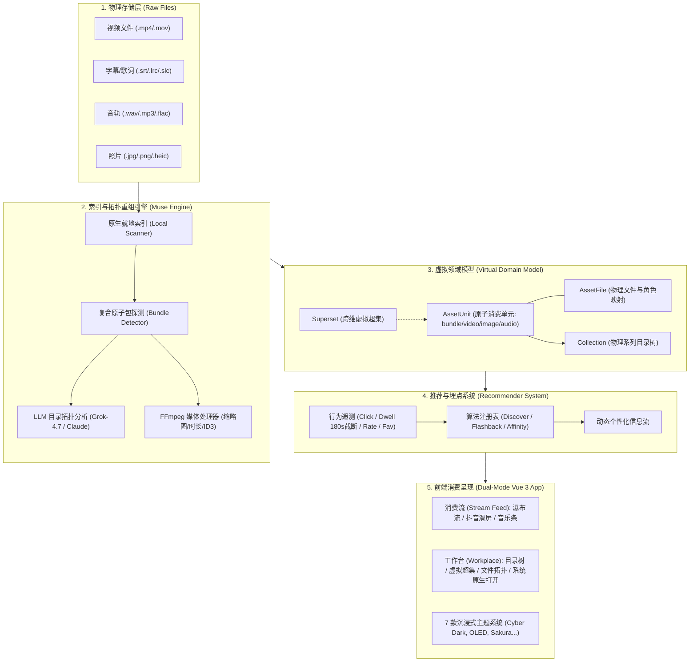

<div align="center">

# 🌊 MuseFlow (灵眸流)

**Local-First, AI-Powered Digital Asset Hub & Algorithmic Streaming Platform**  
*非破坏性本地媒体管理 × 算法推荐流式消费 × 大模型目录拓扑重组*

[](https://github.com/mcocdaa)
[](https://github.com/mcocdaa/MuseFlow/actions)
[](LICENSE)
[](pyproject.toml)
[](frontend/package.json)
[](frontend/package.json)
[](CONTRIBUTING.md)

[English](README.md) | [简体中文](README_CN.md)

</div>

---

## 💡 为什么选择 MuseFlow？(Why MuseFlow?)

现代创作者与数码爱好者的本地多媒体资产越来越庞大且零散：旅游摄影随手拍、Vlog 系列工程（视频 + 外挂字幕 + BGM 音轨 + 封面）、高保真音乐无损合集等。然而，现有的软件体系常常将**“文件管理 (DAM)”**与**“内容消费 (Streaming)”**生硬割裂：

| 维度对比 | 传统素材库 (Eagle / Billfish) | 传统家庭影院 (Jellyfin / Plex) | 传统云相册 (Immich / PhotoPrism) | 🌊 **MuseFlow (灵眸流)** |
| :--- | :--- | :--- | :--- | :--- |
| **底层物理文件** | 强制导入专有库，破坏原始文件结构 | 纯物理只读挂载 | 强行重命名或按时间线迁移 | **零破坏原生就地索引**，随时系统外部调用 |
| **复合音画字合集** | 拆成孤立碎文件，界面一片混乱 | 仅识别单视频或规范剧集 | 无法有效处理字幕与分轨 | **智能打包 `mp4+srt+wav` 最小原子消费单元** |
| **混乱目录拓扑** | 纯人工手工打标签整理 | 死板扫描，不支持子系列智能识别 | 依赖人脸或地点强行归并 | **LLM (如 Grok-4.7) 深度拓扑推断，自动剥离子系列** |
| **浏览消费体验** | 办公表格/密集小图，无沉浸感 | 传统电视海报墙，操作笨重 | 传统相册流水账 | **小红书瀑布流 + 抖音上下滑视频 + 专业悬浮音乐条** |
| **多维虚拟超集** | 仅支持单一目录标签 | 依赖手动建播放列表 | 仅支持人脸聚类 | **虚拟超集 (Supersets)：跨物理系列任意无损重组** |
| **推荐算法流** | 无推荐，纯靠搜索 | 仅有“最近添加/继续观看” | 无 | **可插拔推荐系统 (漫游探索/时光倒流/偏好加权)** |

---

## ✨ 核心特性 (Key Features)

### 1. 🎬 复合原子消费单元 (Smart Atom-Bundle Packaging)
- **不再割裂音画字**：
  - 扫描发现同名或同工程的 `tokyo_vlog.mp4`、`tokyo_vlog.srt` 与 `tokyo_vlog_bgm.wav` 时，自动聚合为一个原子单元（`AssetUnit [bundle]`）。
  - 在播放视频时，后端动态将 `.srt` / `.ass` 转换为浏览器原生兼容的 WebVTT 格式挂载，支持中文编码（UTF-8, GBK, GB18030）自动探测。
  - 独立图片、单曲无损音频（附带 `.lrc` 歌词）、独立视频各自保持原子性，绝不把字幕和音轨作为孤岛碎片卡片推送到信息流中。

### 2. 🤖 LLM 智能目录拓扑重组 (AI Directory Topology Triage)
- **告别脆弱复杂的硬编码正则判断**：
  - 针对深层嵌套与混乱散落（如 `A/a1.png`, `A/a2.png`, `A/B/b1.png`），自动提取相对路径与元数据，调用大语言模型（Grok-4.7 / Claude 3.5 / GPT-4o）进行目录拓扑深度推断。
  - 自动识别子文件夹 `B` 为独立子系列并完整剥离。
  - 识别跨层级存放的音画字（如 `subtitles/ep1.srt` 伴随 `video/ep1.mp4`）并自动打包。
  - **可视化计划预览与一键应用**：用户可在前端查看 AI 整理规划与决策理由，一键确认生效，**磁盘上的物理原始文件毫发无损**。

### 3. 🌊 沉浸流媒体消费与专业工作台双态切换 (Fluid Dual-Mode)
- **沉浸消费流 (Stream Feed)**：
  - 小红书 / B 站风格的双列瀑布流媒体卡片，带高画质智能缩略图与时长胶囊。
  - **抖音式上下滑动视频播放器**：支持键盘 `↑` / `↓` 顺畅无缝滑动切换下一个视频，空格即时暂停，自适应多语言字幕挂载。
  - **原图沉浸画廊**：高帧率平滑缩放、原图查看与 1~5 星即时评分打标。
  - **专业底部音乐播放器**：专辑封面旋动、波形进度条、单曲循环、**睡眠定时器 (15/30/60m)**。
- **资源工作台 (Workplace)**：
  - 物理系列目录树（Collections）+ 多维虚拟超集（Supersets）。
  - 物理文件拓扑面板（清晰查看一个消费包关联的原始磁盘文件路径与分工角色）。
  - 跨平台原生系统联动：支持 **“在系统资源管理器中定位 (`explorer.exe /select` / `open -R` / `xdg-open`)”** 与 **“使用系统默认程序打开”**。

### 4. 🎨 7 款精选沉浸主题配色 (Curated Theme System)
内置 7 款专业设计调色盘，即点即生效，持久化保存：
- 🔮 **幻紫流光 (Cyber Dark)**：经典暗黑极客，霓光紫与极光靛
- 🌌 **黑曜深空 (OLED Pure Black)**：纯黑极致省电，高对比度观影神器
- 🌸 **粉黛微光 (Sakura & Bilibili)**：粉黛微光，二次元与生活记录
- ⚡ **赛博电青 (Cyberpunk Neon)**：冷调深海蓝与高饱和电光青
- 🌲 **苍翠松隐 (Forest Emerald)**：北欧静谧墨绿与薄荷青翠，适合风景旅拍
- 🌅 **落日熔金 (Sunset Amber)**：暖暮晚霞暖棕与落日熔金
- ☀️ **摄影工坊 (Studio Light)**：极简柔光素白白天模式

### 5. 🔌 可插拔推荐算法与防挂机埋点
- **全自动行为埋点**：点击率、5星即时评分、红心收藏、有效停留时长；
- **防挂机截断保护**：单次有效停留上限 180 秒，防止页面长时间后台静置导致推荐权重倾斜；
- **内置三大开箱即用算法**：
  - 🎲 **探索漫游 (Discover)**：全库随机发现，探索未知角落
  - ⏳ **时光倒流 (Flashback)**：优先推荐久未重温的尘封回忆
  - ❤️ **猜你喜欢 (Affinity)**：基于评分与偏好加权

---

## 🏛️ 系统架构 (Architecture)



---

## 🚀 极速上手 (Quick Start)

### 选项 A：本地运行 (通过 `uv` 与 `pnpm`)

#### 1. 前置依赖
- Python: `>= 3.13`（推荐使用 [uv](https://github.com/astral-sh/uv)）
- Node.js: `>= 20`（推荐使用 `pnpm`）
- FFmpeg: `>= 6.0`（用于视频缩略图与时长提取）

#### 2. 克隆仓库与配置环境
```bash
git clone git@github.com:mcocdaa/MuseFlow.git
cd MuseFlow

# 复制环境变量配置
cp .env.example .env
```

#### 3. 一键启动前后端联合开发
```bash
./scripts/dev.sh
```
- 后端服务：`http://localhost:8765`
- 前端服务：`http://localhost:5173`
- API 交互文档：`http://localhost:8765/docs`

#### 4. 生成测试样本媒体库 (可选)
```bash
cd backend && uv run python generate_samples.py
```
> 内置生成包含旅行图库、`tokyo_vlog` 音画字三位一体复合包、散落碎文件的样本库，用于即刻体验！

---

### 选项 B：Docker Compose 容器化部署

只需一行命令即可构建并启动 MuseFlow 生产环境：

```bash
# 启动容器并挂载本地媒体目录
MEDIA_PATH=/path/to/your/media docker compose up -d --build
```
- 访问地址：`http://localhost:8765`
- 挂载说明：
  - `/data`: 存放 SQLite 数据库与媒体缩略图缓存（持久化存储）。
  - `/media`: 你的本地照片、视频与音频源文件目录（只读挂载保障物理安全）。

---

## ⚙️ 环境变量与配置 (Configuration)

在 `.env` 或系统环境变量中配置：

| 变量名 | 默认值 | 说明 |
| :--- | :--- | :--- |
| `MUSEFLOW_HOST` | `0.0.0.0` | 服务监听地址（支持局域网内手机与平板访问） |
| `MUSEFLOW_PORT` | `8765` | 服务监听端口 |
| `MUSEFLOW_DATA_DIR` | `backend/data` | 数据库与缩略图存储路径 |
| `MAX_DWELL_SECONDS` | `180.0` | 推荐系统有效停留时长防挂机截断上限（秒） |
| `LLM_BASE_URL` | `https://pool.creative-koala-llm.top/v1` | OpenAI 兼容的大模型 API 基础地址 |
| `LLM_API_KEY` | `sk-...` | 大模型 API 密钥 |
| `LLM_MODEL` | `grok-4.7` | 用于复杂目录拓扑重组的模型（支持 Grok / Claude / DeepSeek / GPT） |

---

## 📖 文档与深度指南 (Documentation)

- 🏛️ [系统架构与领域实体模型](docs/architecture.md)
- 🤖 [LLM 目录拓扑分析与智能重组指南](docs/ai_triage_guide.md)
- 🔌 [可插拔推荐系统与行为埋点插件规范](docs/recommender_plugin.md)
- 🤖 [AI 编码智能体操作规范与契约](AGENTS.md)
- 🤝 [开源贡献指南 (Contributing)](CONTRIBUTING.md)
- 🔒 [安全漏洞披露政策 (Security)](SECURITY.md)
- 📜 [版本更新日志 (Changelog)](CHANGELOG.md)

---

## 🗺️ 路线图 (Roadmap)

- [x] 非破坏性物理文件索引与系列树建立
- [x] 复合原子单元智能打包 (`mp4+srt+wav`, `mp3+lrc`)
- [x] 大语言模型 (Grok-4.7) 混乱目录拓扑分析与一键重组
- [x] 双态流媒体界面（小红书瀑布流 + 资源管理器工作台）
- [x] 抖音式上下滑动视频流与自适应 WebVTT 字幕挂载
- [x] 专业级悬浮音乐条与睡眠定时器
- [x] 7 款个性化沉浸主题配色与即时持久化
- [x] 跨平台原生文件管理器定位 (`explorer.exe /select`, `open -R`, `xdg-open`)
- [x] Docker 容器化编排与多阶段构建
- [x] GitHub Actions 自动化 CI 流水线与测试集
- [ ] 基于 OpenCV / PIL 的自适应主体构图智能裁剪
- [ ] 本地离线大模型 / Ollama 拓扑分析支持
- [ ] Windows 桌面端原生安装包 (.exe 带系统托盘)

---

## 📄 开源许可证 (License)

本项目基于 [MIT License](LICENSE) 协议开源。欢迎自由使用、扩展与共建！
